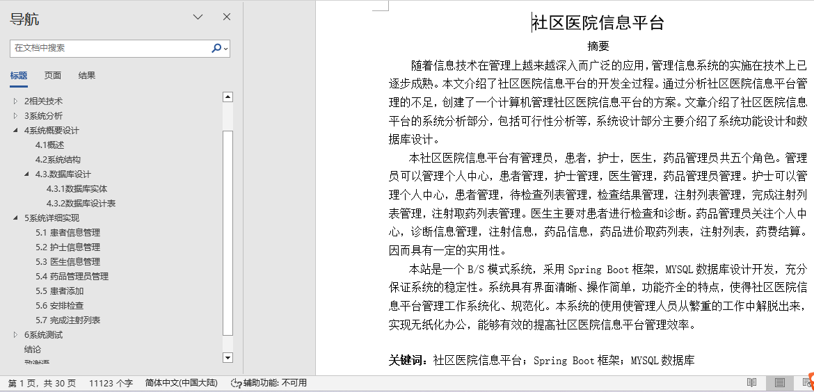
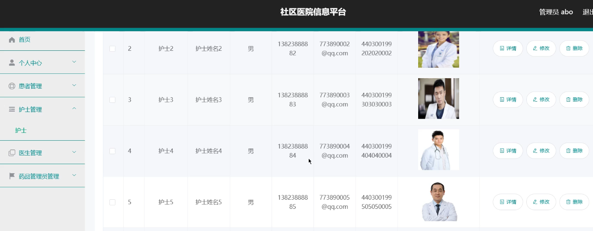
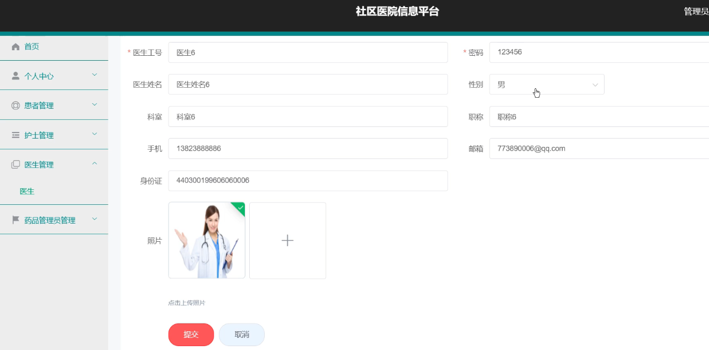
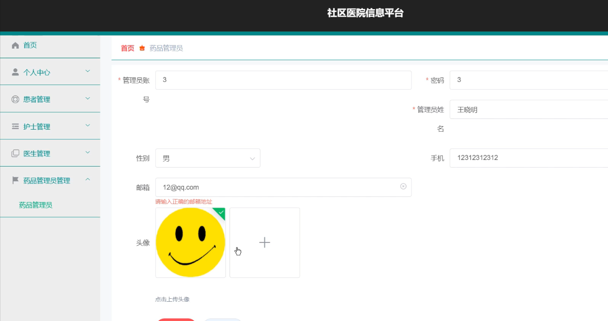
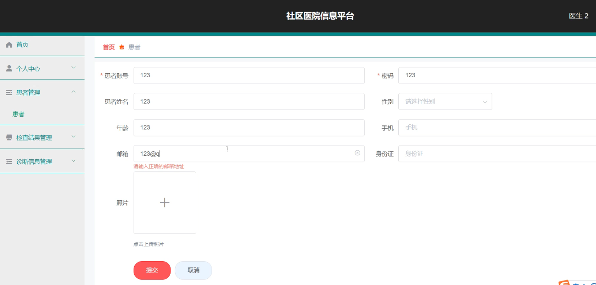
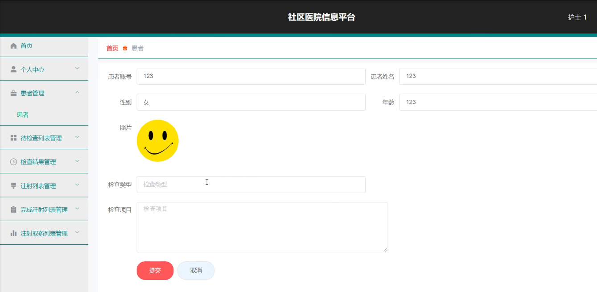
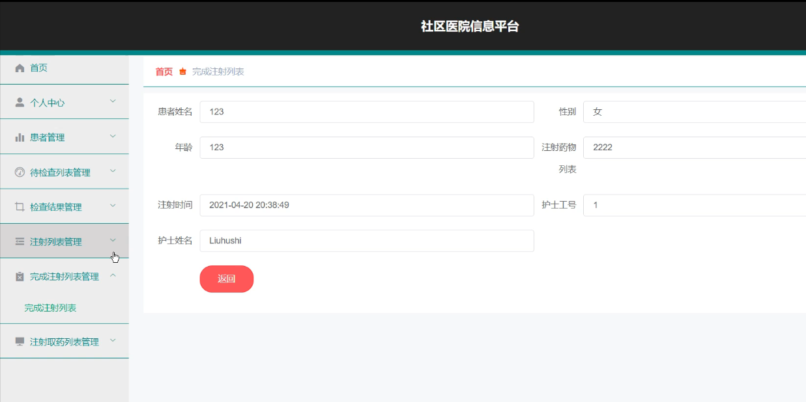
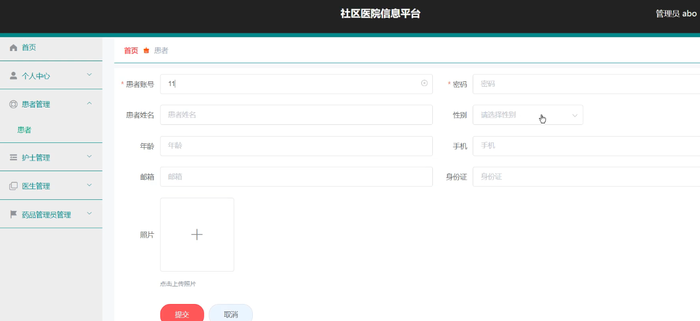

## 社区医院信息平台系统(程序+报告)

###  获取sql数据库文件: 从戎源码网 (https://armycodes.com/) QQ: 386869957 QQ群: 377586148
###  所有系统地址: (https://github.com/YuLin-Coder/AllProjectCatalog) 
###  所有项目以及源代码本人均调试运行无问题 可支持远程安装部署调试、定制修改、代码讲解

## 项目介绍
社区医院信息平台系统，包含两种角色：用户、管理员，系统分为前台和后台两大模块，主要功能如下：

1 患者信息管理
社区医院信息平台的系统管理员可以管理患者信息，包括添加、修改、删除和查询操作。

2 护士信息管理
系统管理员可以对护士信息进行添加、修改、删除和查询操作。

3 医生信息管理
系统管理员可以对医生信息进行添加、修改、删除和查询操作。

4 药品管理员管理
系统管理员可以对药品管理员信息进行添加、修改、删除和查询操作。

5 患者添加
医生可以添加新的患者信息。

6 安排检查
护士登录后可以为患者安排检查。

7 完成注射列表
护士可以查看完成注射的患者列表信息。

## 项目技术
- 编程语言：Java
- 数据库：MySQL
- 项目管理工具：Maven
- 前端技术：HTML、CSS、JavaScript、Vue
- 后端技术：Spring、SpringMVC、MyBatis

## 运行环境
- JDK版本：JDK1.8及以上
- 开发工具：IDEA、Ecplise、Myecplise都可以
- 数据库: MySQL5.7及以上
- Maven：maven3.0及以上
- Node：14.14.0及以上

## 运行截图

